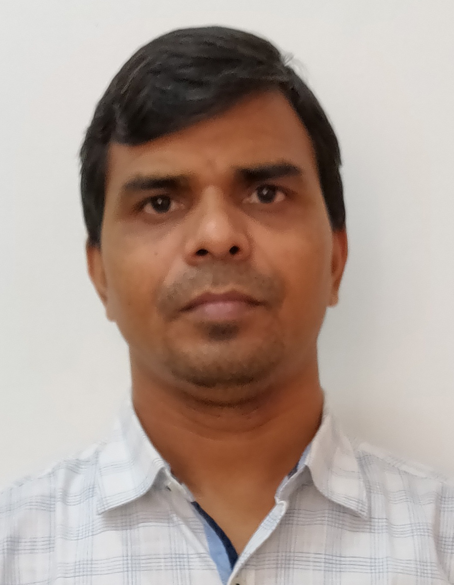

# Prateek Research Team Author Biography
Author|Biography|ORCID|PUBLONS|IEEE
---|---|---|---|---
|Prateek Raj Gautam `has earned his Ph.D. from ECED, Motilal Nehru National Institute of Technology Allahabad, Prayagraj, India. He has served as Assistant Professor in Allenhouse Institute of Technology and Naraina College of Engineering and Technology. He has received M.Tech. in ECE from Harcourt Butler Technological Institute Kanpur, India in 2011. His research interest include energy-efficient scheme for wireless sensor network, Image Processing, CDMA, IDMA, and Brain wave mapping.`|[0000-0002-2889-4275](http://orcid.org/0000-0002-2889-4275)|[1760197](https://publons.com/researcher/1760197/prateek-raj-gautam/)|91250146
|Sunil Kumar `received Ph.D in ECE from MNNIT Allahabad and M.Tech. in ECE from Harcourt Butler Technological Institute Kanpur, India in 2011. His research interest include energy-efficient scheme for wireless sensor network.` |[0000-0002-9438-0635](http://orcid.org/0000-0002-9438-0635)|J-2747-2017|94103323
|`Akshay Verma received Ph.D from MNNIT Allahabad and M.Tech in ECE from National Institute of Technology Jalandhar, Jalandhar, India in 2016. His research interest includes energy efficient routing algorithm designing in wireless sensor networks.`|[0000-0002-4112-0709](https://orcid.org/0000-0002-4112-0709)|---|94188560
|Tarique Rashid `received Ph.D in ECE from MNNIT Allahabad and M.Tech in Electronics and Communication Engineering from Motilal Nehru National Institute of Technology Allahabad, Allahabad, India in 2014. He is currently working as an Assistant Professor in the Department of Electrical and Electronics Engineering, Katihar Engineering College, Katihar, India.  His research interest includes energy-efficient routing algorithm for Intra-WBSN.`|---|---|93285869
|Arvind Kumar `received Ph.D. degree from Motilal Nehru National Institute of Technology Allahabad, Prayagraj, India in 2013. He is currently working as an Associate Professor in the Department of Electronics and Communication Engineering, Motilal Nehru National Institute of Technology Allahabad, Prayagraj,  India. He has published more than 20 papers in various journal and conference.`|[0000-0003-3283-5849](https://orcid.org/0000-0003-3283-5849)|[J-3182-2017](http://www.researcherid.com/rid/J-3182-2017)|90849059

## Forms and Download links  

[Submit correction here](https://forms.gle/v2c3aVSRJKhpHBAD9)  
[Download excel sheet](https://goo.gl/RUvKE3)
