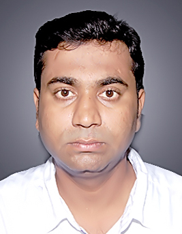

# Prateek Research Team Author Biography
Author|Biography|ORCID|RID|IEEE  
---|---|---|---|---  
|Prateek Raj Gautam `received M.Tech. degree in Electronics and Communication Engineering from Harcourt Butler Technological Institute Kanpur, India in 2011. He is currently pursuing Ph.D. degree with Motilal Nehru National Institute of Technology Allahabad, Prayagraj, India. His research interest include energy-efficient scheme for wireless sensor network, Image Processing, CDMA, IDMA, and Brain wave mapping.`|[0000-0002-2889-4275](http://orcid.org/0000-0002-2889-4275)|[I-9311-2017](http://www.researcherid.com/rid/I-9311-2017)|91250146
|Sunil Kumar `received M.Tech. degree in Electronics and Communication Engineering from Harcourt Butler Technological Institute Kanpur, India in 2011. He is currently pursuing Ph.D.    degree with Motilal Nehru National Institute of Technology Allahabad, Prayagraj, India. His research interest include energy-efficient scheme for wireless sensor network.` |0000-0002-9438-0635|J-2747-2017|94103323
|`Akshay Verma received M.Tech degree in Electronics and Communication Engineering from National Institute of Technology Jalandhar, Jalandhar, India in 2016. He is currently pursuing Ph.D. degree with Motilal Nehru National Institute of Technology Allahabad, Prayagraj, India. His research interest includes energy efficient routing algorithm designing in wireless sensor networks.`|[0000-0002-4112-0709](https://orcid.org/0000-0002-4112-0709)|---|94188560
|Tarique Rashid `received M.Tech degree in Electronics and Communication Engineering from Motilal Nehru National Institute of Technology Allahabad, Allahabad, India in 2014. He is currently pursuing a Ph.D. degree with Motilal Nehru National Institute of Technology Allahabad,Prayagraj, India. He is currently working as an Assistant Professor in the Department of Electrical and Electronics Engineering, Katihar Engineering College, Katihar, India.  His research interest includes energy-efficient routing algorithm for Intra-WBSN.`|---|---|---
|Arvind Kumar `received Ph.D. degree from Motilal Nehru National Institute of Technology Allahabad, Prayagraj, India in 2013. He is currently working as an Associate Professor in the Department ofElectronics and Communication Engineering, Motilal Nehru National Institute of Technology Allahabad, Prayagraj,  India. He has published more than 20 papers in various journal and conference.`|[0000-0003-3283-5849](https://orcid.org/)|---|90849059

## Forms and Download links  

[Submit correction here](https://forms.gle/v2c3aVSRJKhpHBAD9)  
[Download excel sheet](https://goo.gl/RUvKE3)
